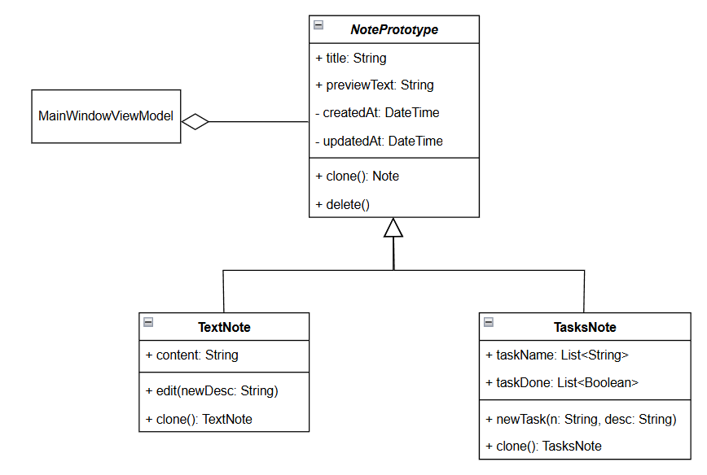

## Лабораторная работа №1 — Паттерн «Prototype»

### Предметная область

Настольное приложение для ведения заметок **ObsidiaNote**.
Система поддерживает два типа заметок:

| Тип заметки  | Описание                                    |
| ------------ | ------------------------------------------- |
| Текстовая    | Содержит произвольный текст                 |
| Список задач | Содержит набор задач с признаком выполнения |

Пользователь может:

* создавать заметки разных типов,
* редактировать их,
* добавлять задачи,
* **клонировать существующие заметки**.

Клонирование должно создавать **полную независимую копию объекта**, чтобы изменения в копии не влияли на оригинал.

---

## Описание проблемы

Без применения паттерна «Prototype» клонирование могло бы выглядеть следующим образом:

```csharp
if (SelectedNote is TextNote tn)
{
    var copy = new TextNote
    {
        Title = tn.Title,
        Content = tn.Content,
        CreatedAt = tn.CreatedAt,
        UpdatedAt = DateTime.Now
    };
}

if (SelectedNote is TasksNote tasks)
{
    var copy = new TasksNote
    {
        Title = tasks.Title,
        CreatedAt = tasks.CreatedAt,
        UpdatedAt = DateTime.Now,
        TaskNames = new List<string>(tasks.TaskNames),
        TaskDone = new List<bool>(tasks.TaskDone)
    };
}
```

### Проблемы такого подхода

1. При добавлении нового типа заметки (например, `ImageNote`) придётся изменять код клонирования во всех местах.

2. Клиентский код зависит от конкретных типов (`TextNote`, `TasksNote`).

3. Дублирование логики копирования

4. Каждый новый тип потребует нового `if` или `switch`.

---

## Решение: применение паттерна «Prototype»

### Идея паттерна

Паттерн **Prototype** позволяет создавать новые объекты путём клонирования существующих, не зная их конкретного класса.

Клиент работает через общий абстрактный класс (или интерфейс), вызывая метод `Clone()`.

---

## Абстрактный прототип

Базовый класс определяет общий метод клонирования:

```csharp
public abstract class NotePrototype
{
    public string Title { get; set; }
    public DateTime CreatedAt { get; protected set; }
    public DateTime UpdatedAt { get; set; }

    public abstract NotePrototype Clone();
    public abstract string PreviewText { get; }
}
```

---

## Конкретные прототипы

### Текстовая заметка

```csharp
public class TextNote : NotePrototype
{
    public string Content { get; set; }

    public override NotePrototype Clone()
    {
        return new TextNote
        {
            Title = this.Title,
            Content = this.Content,
            CreatedAt = this.CreatedAt,
            UpdatedAt = DateTime.Now
        };
    }
}
```

* Новый объект полностью независим от оригинала

---

### Заметка со списком задач

```csharp
public class TasksNote : NotePrototype
{
    public List<string> TaskNames { get; set; }
    public List<bool> TaskDone { get; set; }

    public override NotePrototype Clone()
    {
        return new TasksNote
        {
            Title = this.Title,
            CreatedAt = this.CreatedAt,
            UpdatedAt = DateTime.Now,
            TaskNames = new List<string>(this.TaskNames),
            TaskDone = new List<bool>(this.TaskDone)
        };
    }
}
```

* Копия полностью изолирована от оригинала

---

## Клиент паттерна — MainWindowViewModel

Клиент работает **только с абстракцией `NotePrototype`**:

```csharp
private void CloneSelected()
{
    if (SelectedNote == null) return;

    var clone = SelectedNote.Clone();
    clone.Title += " (копия)";
    AddNote(clone);
}
```

### Важно

* ViewModel **не знает конкретный тип заметки**
* Нет `switch` или `if` по типам
* Используется полиморфизм

---

## Диаграмма классов 



---

## Преимущества реализации

### 1. Масштабируемость

Чтобы добавить новый тип заметки:

* создать новый класс-наследник `NotePrototype`
* реализовать метод `Clone()`

Изменять `MainWindowViewModel` не требуется.

---

### 2. Полиморфизм вместо ветвлений

Нет `switch` по типам.
Код расширяем без модификации.

---

### 3. Инкапсуляция логики копирования

Каждый класс сам знает:

* какие поля копировать
* какие значения обновлять (например, `UpdatedAt`)

---

## Когда применение Prototype оправдано

Паттерн целесообразен, если:

* создание объекта сложное или дорогое
* требуется создавать копии уже настроенных объектов
* нужно избежать жёсткой зависимости от конкретных классов
* система должна быть расширяемой

---

## Запуск приложения

Из папки с `.csproj`:

```bash
dotnet run
```

---

## Вывод

Внедрение паттерна «Prototype» позволило:

* Устранить ветвление по типам при клонировании.
* Перенести ответственность за копирование внутрь самих классов.
* Сделать систему расширяемой — новые типы заметок добавляются без изменения существующего клиентского кода.

Таким образом, паттерн «Prototype» обеспечивает гибкое и безопасное клонирование объектов в архитектуре приложения.