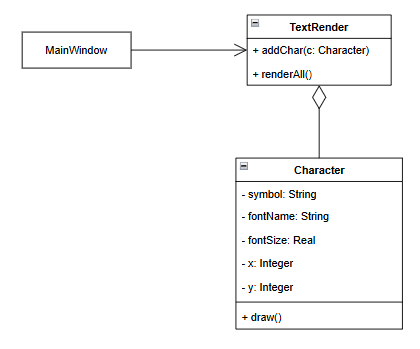
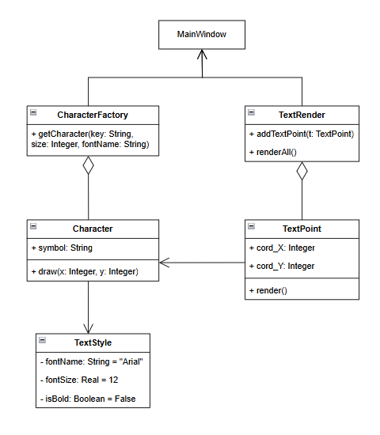

# Лабораторная работа №2 — Паттерн «Flyweight» (Приспособленец)

---

## 1. Предметная область и описание проблемы

Система визуализации текста для графического редактора. При отображении больших объемов текста (например, книги или длинной заметки) создание отдельного "тяжелого" объекта для каждого символа приводит к избыточному потреблению оперативной памяти.

**Ключевые сущности:**
*   **Символ**: значение (например, 'A', 'H', '!').
*   **Стиль**: параметры шрифта (название, размер, начертание).
*   **Позиция**: координаты $x$ и $y$ на холсте.

При 10 000 символов программа создает 10 000 объектов, дублируя данные шрифта.

```cpp
// Пример неоптимального подхода (без паттерна)
for (char c : "Hello World") {
    render.addChar(Character(c, 10, 10, "Arial", 12.0f, false)); 
}
```

### Последствия:
*   **Высокое потребление RAM**: Тысячекратное дублирование одинаковых данных.
*   **Сложность обновлений**: Изменение стиля требует обхода всех объектов.

---

## 2. Решение - Паттерн «Flyweight»

### Идея
Разделение состояния на два типа:
1.  **Внутреннее (Intrinsic)**: Неизменяемые данные (Символ, Шрифт). Кэшируются и разделяются.
2.  **Внешнее (Extrinsic)**: Уникальные данные (Координаты). Передаются в метод в момент отрисовки.

### Реализация
**Внутреннее состояние:**
```cpp
struct TextStyle {
    std::string fontName;
    float fontSize;
    bool isBold;
};

class Character {
public:
    std::string symbol;
    TextStyle* style; 

    void draw(int x, int y) const {
        std::cout << "Drawing '" << symbol << "' at [" << x << "," << y << "]";
    }
};
```

**Фабрика (CharacterFactory):**
Гарантирует переиспользование объектов, предотвращая дубликаты.

| Параметр | Без паттерна | С паттерном (Flyweight) |
| :--- | :---: | :---: |
| **Объектов для "Hello World"** | 11 | 8 |
| **Дублирование шрифтов** | Да | Нет |
| **Кэширование** | Нет | Да |

---

## 3. Диаграммы классов

#### Реализация без паттерна


#### Реализация с паттерном


---

## 💡 Вывод

Использование паттерна **FlyWeight** позволило оптимизировать работу программы по трем ключевым направлениям:

- **Оптимизация памяти (RAM):** Программа перешла от дублирования данных к их разделению. \
Вместо хранения тысячи копий строки "Arial" для каждой буквы, в памяти теперь хранится один объект стиля, на который ссылаются все символы.

- **Снижение нагрузки на кучу (Heap):** Благодаря фабрике CharacterFactory количество операций выделения памяти (new) сократилось до количества уникальных символов в тексте. \
Повторяющиеся элементы (например, буквы в слове "Hello") мгновенно извлекаются из кэша.

- **Гибкость управления:** Изменение параметров оформления (размер, шрифт) теперь происходит мгновенно для всего текста. \ 
Достаточно изменить один общий объект TextStyle, и все зависимые символы обновятся автоматически без перебора всей коллекции.