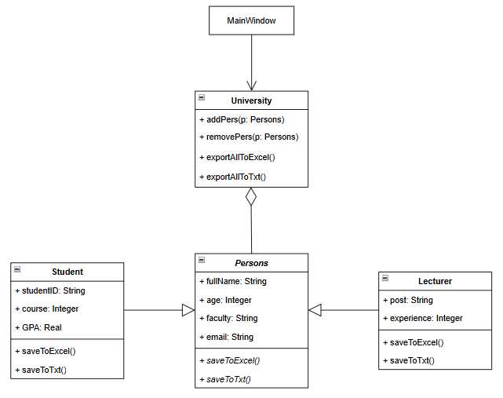
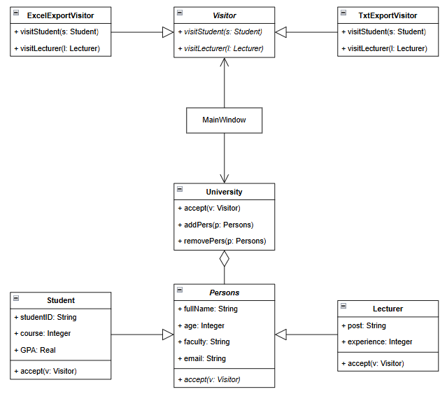

# Лабораторная работа №3 — Паттерн «Visitor» (Посетитель)

---

## 1. Предметная область и описание проблемы

Система управления базой данных университета. В системе хранятся различные типы людей (студенты и преподаватели), обладающие как общими (ФИО, возраст), так и уникальными атрибутами (GPA у студентов, стаж у преподавателей). Требуется реализовать экспорт этих данных в различные форматы (Excel, TXT).

**Ключевые сущности:**
*   **Person (Человек)**: базовый абстрактный класс.
*   **Student (Студент)** / **Lecturer (Преподаватель)**: конкретные классы предметной области.
*   **University (Университет)**: класс-контейнер, хранящий список всех людей.

При реализации «в лоб» логика сохранения данных помещается прямо внутрь классов. При добавлении нового формата экспорта (например, JSON или PDF) приходится модифицировать каждый класс в иерархии `Person`.

```python
# Пример неоптимального подхода (без паттерна)
class Student(Persons):
    def exportToExcel(self, ws):
        ws.append(["Студент", self.fullName, self.GPA])
        
    def exportToTxt(self, file):
        file.write(f"Студент: {self.fullName}")
```

### Последствия:
*   Классы предметной области (`Student`, `Lecturer`) вынуждены знать про сторонние библиотеки (`openpyxl`) и работу с файловой системой.
*   Добавление нового формата экспорта требует переписывания уже существующих, протестированных классов моделей.
*   Классы данных становятся перегруженными не связанными с их сутью методами.

---

## 2. Решение - Паттерн «Visitor»

### Идея
Отделение алгоритмов (логики экспорта) от объектов, над которыми они выполняются.
Используется механизм **двойной диспетчеризации (Double Dispatch)**: объект сам решает, какой метод посетителя вызвать, передавая ему себя `self` в качестве аргумента.

### Реализация
**Абстракция посетителя и моделей:**
Вместо написания методов экспорта, в классы `Student` и `Lecturer` добавляется только один метод `accept(Visitor)`, который никогда больше не меняется. Вся логика работы с Excel и TXT выносится в отдельные классы `ExcelExportVisitor` и `TxtExportVisitor`.

```python
class Visitor(ABC):
    @abstractmethod
    def visitStudent(self, s: Student): 
        pass

class ExcelExportVisitor(Visitor):
    def visitStudent(self, s: Student):
        # Вся логика работы с Excel изолирована здесь
        self.ws.append(["Студент", s.fullName, s.GPA])

class Student(Persons):
    def accept(self, v: Visitor):
        v.visitStudent(self) # Двойная диспетчеризация
```

---

## 3. Диаграммы классов

#### Реализация без паттерна


#### Реализация с паттерном


---

## Вывод

Использование паттерна **Visitor** позволило оптимизировать архитектуру приложения:

- Основные классы (`Student`, `Lecturer`) были полностью очищены от логики генерации файлов. Теперь они занимаются исключительно хранением состояния объекта, а генерация отчетов инкапсулирована в соответствующих «Посетителях».
- Архитектура стала легко расширяемой. Если в будущем университету понадобится выгрузка данных в форматах JSON, XML или генерация HTML-страниц, потребуется лишь создать новый класс, наследующий интерфейс `Visitor`, без единой правки в существующих классах моделей.
- Благодаря механизму двойной диспетчеризации (Double Dispatch) через метод `accept`, паттерн решает проблему определения точного типа объекта (Студент или Преподаватель) во время выполнения программы (Runtime), исключая необходимость использования проверок типа `isinstance()` или `typeof`.