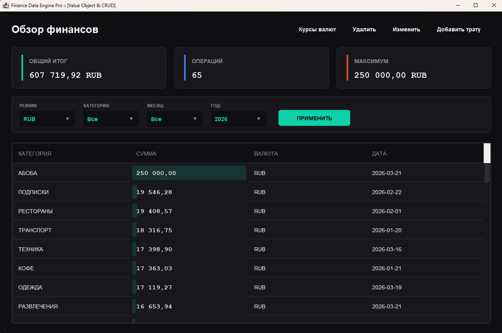

# Лабораторная работа №4 — Паттерн «Value Object» (Объект-значение)

---

---

## 1. Предметная область и описание проблемы

## 2. Решение

### Идея

### Реализация

---

## 3. Диаграммы классов

#### Реализация без паттерна

#### Реализация с паттерном

---

## Вывод

- а
- б
- о
- б
- а
