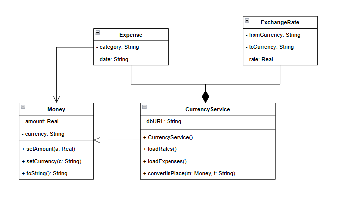
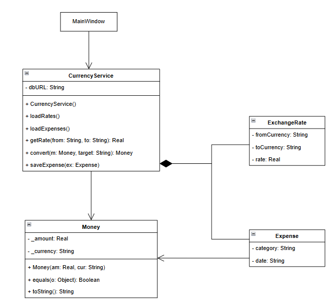

# Лабораторная работа №4 — Паттерн «Value Object» (Объект-значение)

## 1. Предметная область и описание проблемы

Система учета личных финансов с поддержкой мультивалютности. Приложение хранит записи о расходах в разных валютах (USD, EUR, RUB) и должно уметь конвертировать их в целевую валюту, а также суммировать для получения общего итога.

**Ключевые сущности:**
* **Expense (Расход)**: категория, дата и денежная сумма.
* **ExchangeRate (Курс обмена)**: направление конвертации и коэффициент.
* **CurrencyService**: сервис, управляющий расчетами и базой данных.

При реализации «без паттерна» денежная сумма представляется либо примитивами (`double`), либо объектами с сеттерами. Это приводит к потере точности и непредсказуемым изменениям данных.

```java
// Пример неоптимального подхода (без паттерна - Mutable Money)
public void convertInPlace(Money m, String target) {
    double rate = getRate(m.getCurrency(), target);
    // Прямое изменение состояния объекта (Side Effect)
    m.setAmount(m.getAmount().multiply(BigDecimal.valueOf(rate)));
    m.setCurrency(target);
}
```

### Последствия:
* **Побочные эффекты:** При конвертации для отображения в GUI данные в памяти (список трат) необратимо меняются.
* **Потеря точности:** Использование `double` для финансовых вычислений приводит к ошибкам округления (например, `0.1 + 0.2 = 0.30000000000000004`).
* **Нарушение инвариантов:** Любая часть программы может установить отрицательную сумму или некорректный код валюты через сеттеры.

---

## 2. Решение — Паттерн «Value Object»

### Идея
Использование специализированного **Value Object** (Объекта-значения). Основные принципы:
1.  **Immutability (Неизменяемость)**: Объект не имеет сеттеров. Любая операция (конвертация) возвращает **новый** экземпляр `Money`.
2.  **Self-Validation**: Объект сам гарантирует свою валидность (проверка на `null`, отрицательные значения и формат валюты в конструкторе).
3.  **Encapsulated Logic**: Логика округления (`RoundingMode`) и сравнения инкапсулирована внутри класса.

### Реализация
**Использование Immutable Money:**
Вместо изменения существующих объектов, `CurrencyService` создает новые цепочки вычислений. Это гарантирует, что исходные данные о тратах в базе или кэше останутся в оригинальной валюте.

```java
// Паттерн Money (Value Object)
public class Money {
    private final BigDecimal amount; // final - залог неизменяемости
    private final String currency;

    public Money(BigDecimal amount, String currency) {
        // Округление и валидация при создании
        this.amount = amount.setScale(2, RoundingMode.HALF_UP);
        this.currency = currency.toUpperCase();
    }

    public Money add(Money other) {
        // Возвращаем НОВЫЙ объект
        return new Money(this.amount.add(other.amount), this.currency);
    }
}
```

---

## 3. Диаграммы классов

### Реализация без паттерна



### Реализация с паттерном (Value Object)



---

## 4. Вывод

Использование паттерна **Value Object** позволило решить критические проблемы финансового ПО:

* **Надежность данных:** Благодаря неизменяемости (`Immutability`), риск случайного изменения валюты в списке трат при конвертации для GUI сведен к нулю.
* **Упрощение отладки:** Отсутствие побочных эффектов (Side Effects) делает код предсказуемым. Метод `convert` всегда возвращает предсказуемый результат, не затрагивая аргументы.
* **Валидность:** Централизованная проверка в конструкторе `Money` исключает появление в системе «битых» данных (сумм без валюты или отрицательных транзакций), что упрощает логику в слое GUI.
